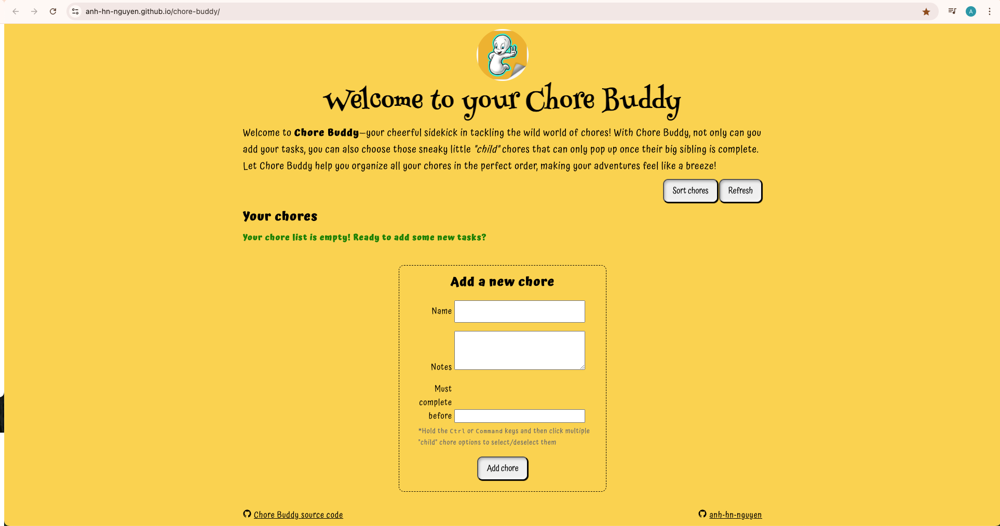
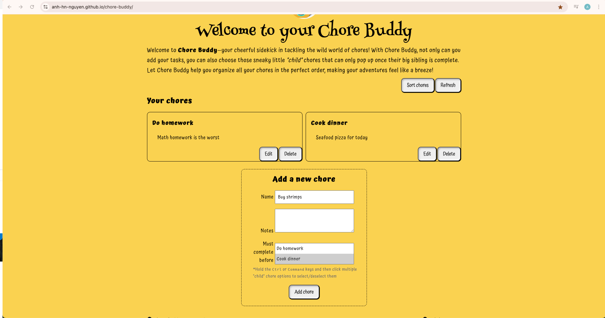
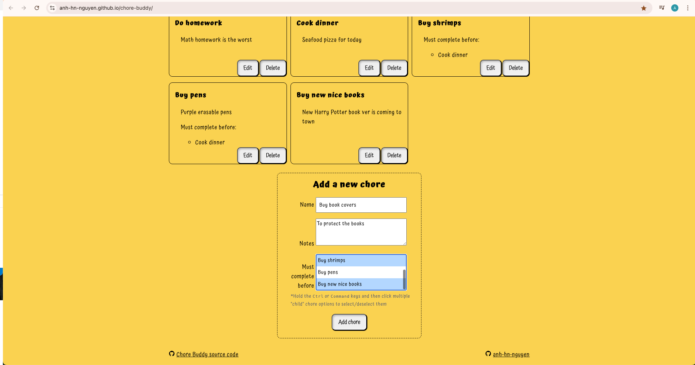
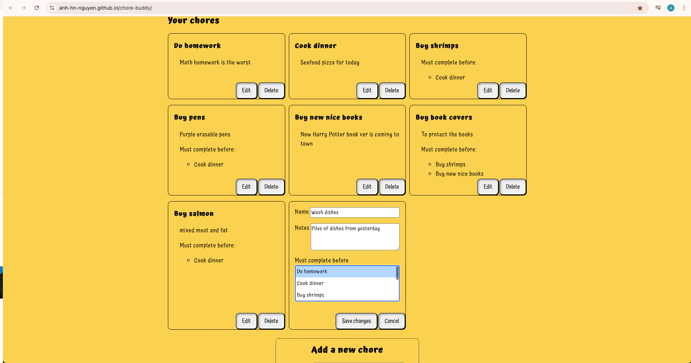
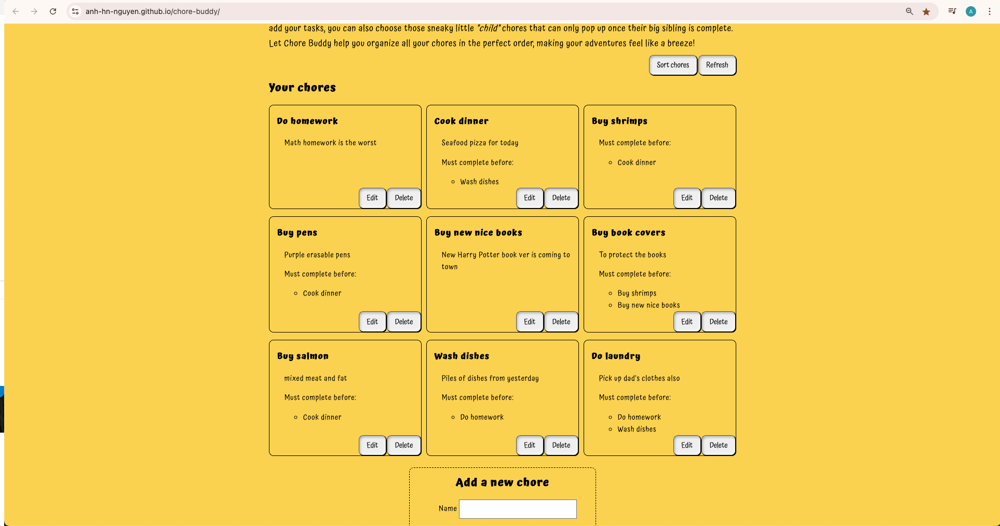
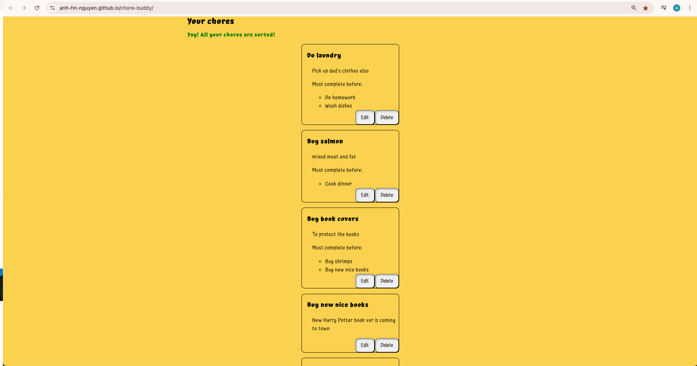
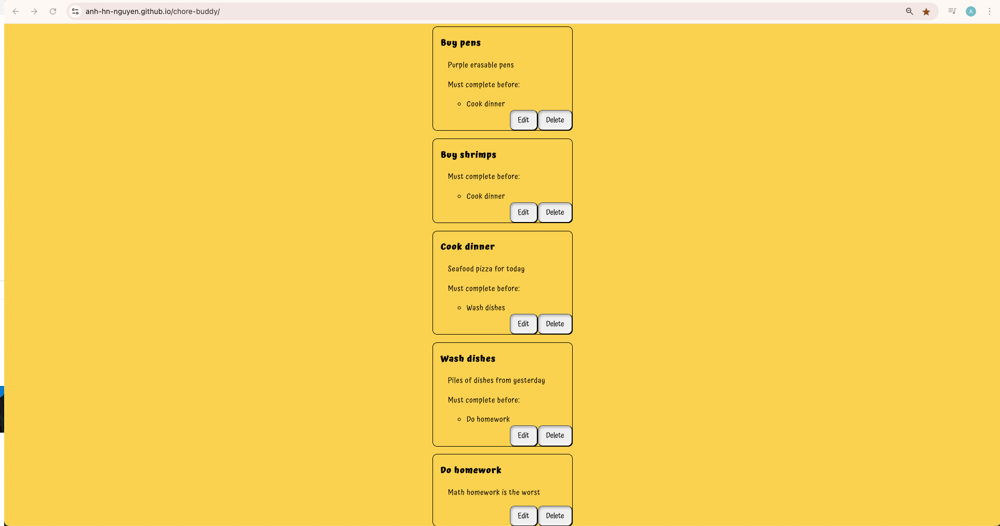
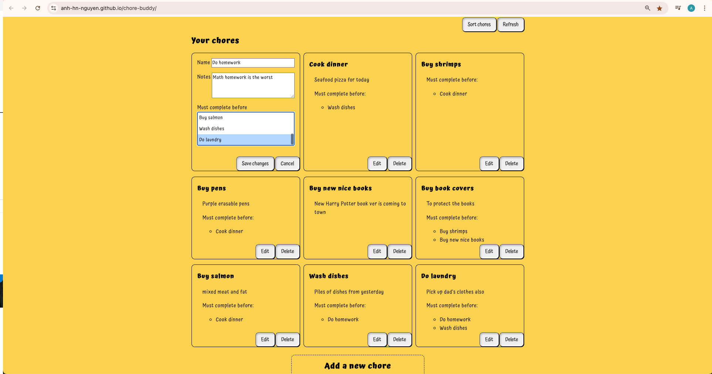
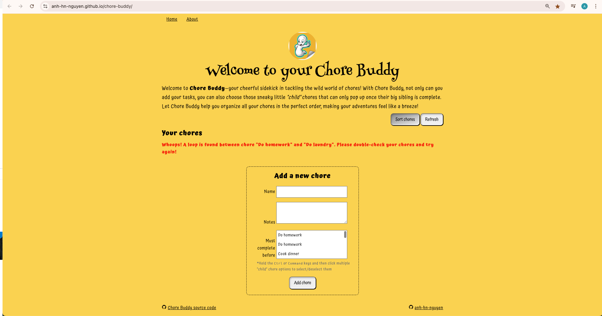

# Chore Buddy

## What does the app do?
Chore Buddy organizes household chores in a logical order by analyzing user-defined tasks and their interrelationships. The app idenitifies key "ancestor" chores that need to be completed first to prevent delays in dependent chores. The app also detects cycles (i.e. loops) in the chore sequences if existed.

## Input - Output
### Input

List of chores. Each chore includes:

- Name (required)
- Notes (optional)
- List of "child" chores (optional). "Child" chores are the ones can start only after this chore is complete.

### Output

- Order of chores to carry out, if no loop detected 

- Otherwise, an error indicating which pair of chores contain the loop (the back edge)

### Output
## Sample
1. First time accessing the app:

2. Add some chores

3. Add a new chore with multiple "child" chores

4. Edit a chore

5. 9 chores before sort

6. 9 chores after sort

7. Try closing your browser and access the app again. Your chores persist!

8. Try adding a loop

9. Error displayed when sorting with loop

